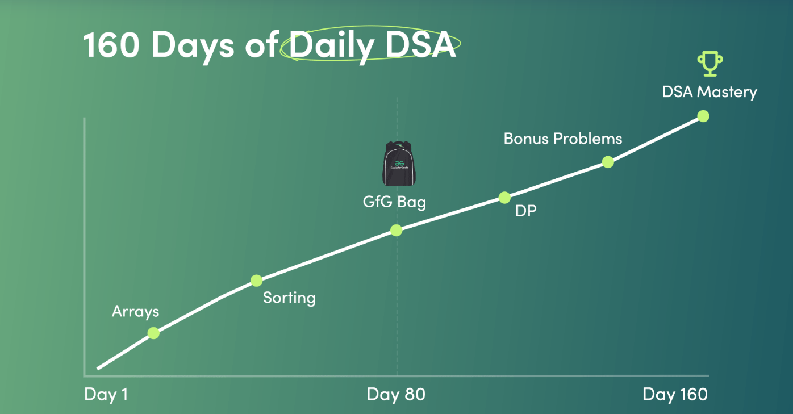

# 160 Days of DSA with GeeksforGeeks✅


Welcome to the 160 Days of Data Structures and Algorithms (DSA) challenge with GeeksforGeeks! This repository is dedicated to tracking my progress and solutions to various DSA problems over the course of 160 days.

## Overview

The goal of this challenge is to improve problem-solving skills and gain a deeper understanding of data structures and algorithms by solving a variety of problems provided by GeeksforGeeks.

## Structure👇🏻

The repository is organized as follows:

- **Day 1 to Day 160**: Each day has its own folder containing the problems solved on that day.
- **Solutions**: Each problem's solution is provided in a separate file with appropriate comments and explanations.

## Progress

| Day | Topics Covered | Problems Solved |
|-----|----------------|-----------------|
| 1   | Arrays         | 3               |
| 2   | Linked Lists   | 2               |
| ... | ...            | ...             |
| 160 | Graphs         | 4               |

## How to Use

1. Clone the repository:
    ```bash
    git clone https://github.com/ankitmodanwall/DSA-160-Days-GFG.git
    ```
2. Navigate to the desired day's folder to view the problems and solutions.

## Resources

- [GeeksforGeeks](https://www.geeksforgeeks.org/)
- [DSA Self Paced Course](https://practice.geeksforgeeks.org/courses/dsa-self-paced)

## Contributing

If you have any suggestions or improvements, feel free to open an issue or submit a pull request.

## License

This project is licensed under the MIT License.

Happy Coding!
